# Demo: Flask with PostgreSQL on Heroku
Somewhere between a tutorial and an anatomy of a simple Flask app with PostgreSQL and Heroku.

We're doing important work here... enabling users to vote for their favorite of these two pictures: 
<div>
 
 </div>

[View an example here:](http://pg-flask.herokuapp.com/)

While the resulting application is different, the structure of this project is adapted from a wonderful [tutorial](https://itnext.io/use-flask-cli-to-create-commands-for-your-postgresql-on-heroku-in-6-simple-steps-e8166c024c8d) by [Felipe Florencio Garcia](https://github.com/felipeflorencio). For a step-by-step approach on how to get (basically) here, I highly recommend it.

Ultimately, the hope for this repository is to demonstrate/visualize the relationships between the different components of this Flask app.

<!--ts-->
  * [Flask app structure](#flask-app-structure)
     * [Configuration files:](#configuration-files)
        * [config.py](#configpy)
        * [.env / Heroku config vars](#env--heroku-config-vars)
     * [Database / data modeling:](#database--data-modeling)
        * [database.py](#databasepy)
        * [model.py](#modelpy)
        * [commands.py](#commandspy)
     * [The app itself:](#the-app-itself)
        * [app.py](#apppy)
  * [Webservice logic](#webservice-logic)
     * [Default endpoint](#default-endpoint)
     * [Home page HTML](#home-page-html)
     * [The '/add' endpoint](#the-add-endpoint)
<!--te-->

## Flask app structure
Our Flask app is constructed from a number of interconnecting scripts. The diagram below shows (roughly) how they interact.

Note that on the right-hand side, the unlabeled arrows just represent `import` statements, e.g. `model.py` importing something from `database.py`.

On the left side, we have `app.py` calling `app.config...`, which makes use of `config.py`. And both `app.py` and `config.py` make use of shell-level environment variables using the `os` module.

We'll get into the details below:



### Configuration files:
#### `config.py`

We want to run our application in two different configurations:
* **Production:** This configuration is for the actual deployment on Heroku.
* **Development:** This configuration is for our own use while developing the app. We tell Flask to enable debugging, so that our server restarts whenever we save `app.py`. We also set the URL for our PostgreSQL database to our local, development database.

#### `.env` / Heroku config vars
We don't want to expose the endpoint for our database, so we're going to save
the URL in a shell environment variable called DATABASE_URL. We could do this manually by running `export DATABASE_URL=<url here>`, but instead we're going to save these variables somewhere our app knows how to access them.

* On our local machine, create a text file named `.env`. **Make sure that this file is listed in your .gitignore.** If you're using the standard Python `.gitignore`, it will be listed. As a result, `.env` won't be tracked in your repository, and your secrets will be safe with you.
* Write to `.env` like you see below, replacing `<url here>` with the actual URL for your database. It probably looks something like `postgres://admin@localhost:password@dbflask`, but generally, it has the form `postgres://<user>@<host>:<password>@<database_name>`.
```
APPLICATION_SETTINGS=config.DevelopmentConfig(base)
DATABASE_URL= <url here>
```
Now, when you `flask run` or `heroku local web` on your own machine, the application will be able to use these values.
1. `$APPLICATION_SETTINGS` is referenced in `app.py`, and is used to call the appropriate class from `config.py`. When we run locally, this means we use the class `DevelopmentConfig(base)`.
2. `DATABASE_URL` is referenced in `config.py`.

**On Heroku, this will work a bit differently.**

1. Open the Heroku Console.
1. Navigate to your application's settings.
1. Look for "reveal config vars" and click it.
1. Fill in those key-value pairs. You should likely already see a value for DATABASE_URL, so create a new one with:
  * `APP_SETTINGS : config.ProductionConfig(base)`


**It is very important to keep these kinds of values out of your public repository.** If your `DATABASE_URL` was exposed, it would be a security concern. That might not seem too important in a setting like this, but it's a common (and important) pattern in software development. Similarly, if your app uses anything like private API keys, or really any information that should be protected, this is a good way to handle it.


### Database / data modeling:
#### `database.py`
It may not seem like this script does very much. In some ways, this is true. Ultimately, it just creates a `SQLAlchemy()` object, then defines a function.
* One thing to keep in mind: since `db` is instantiated in this script, we can actually reference this object later. Often, we think of `import ...` as loading in functions and classes, but in fact it also imports objects of arbitrary types.

#### `model.py`
This one is pretty short, as well. We only do 2 things:
1. Import the `db` object from `database.py`.
* This creates a relationship between our data model (literally the `Model` class) and our database connection.
* This, in turn, makes it very easy for Flask to set up the database with the commands we create in `commands.py`.
1. Define the data model. This `Model` class will become a table in our Postgres database.

Note that we're using `flask_sqlalchemy` here - a package which, unsurprisingly, makes it easier to integrate Flask and SQLAlchemy. As a result, the `Model` class actually inherits from `db.Model`, which is bound to our `db` object.

You can read more about `flask_sqlalchemy` here.

On the specification of the data model:
1. We define a column called `row_id` as a primary key. When we create new rows/objects in our database, we will leave the `row_id` argument blank, and SQLAlchemy will automatically treat it as a range-style index.
1. We have a time stamp column for when each vote is recorded. We use a default value of `db.func.current_timestamp()` so that the time is recorded automatically.
1. We say that the `vote` column should be non-nullable, i.e. it cannot contain missing values. If we wanted to, we could enforce more structure on our columns. We could add a **CONSTRAINT** on this column so that it can only take the expected vote values "Gummi" and "Pita". We're keeping it simple for now, but it's not a bad idea.

#### `commands.py`
Since our application combines multiple services, a web server and an external database, setting everything up gets a little more complicated. In this script, we define some Flask CLI commands for dealing with our database.

Notably, we can use the command `flask db_create_all` to create all the tables currently described in our SQLAlchemy data model. Since `commands.py` imports from `model.py`, it has registered all data tables and the relationships between them. Similarly, since it imports `db` from database, it knows which PostgreSQL database it's working with.

If we didn't have this command, we would have to do one of the following things:
1. Create the tables manually. This might mean opening an interactive Postgres shell with  `psql` (locally) or `heroku pg:psql` for our production app.
1. Maintain another file that specifies the database schema in raw SQL.

In either case, we would be describing the structure of the database in two different places (`models.py` and e.g. `schema.sql`), and this gets harder to maintain.

Creating these Flask CLI commands, then, is powerful. It means that our SQLAlchemy specification in `models.py` can completely define the relational structure of our database, and it saves us a lot of work.
### The app itself:
#### `app.py`
With all the other pieces in place, this part is rather straightforward. Essentially, this script does the following:
1. Import external libraries and local modules
1. Create and configure the flask application
1. Set up the database connection
1. Register the Flask CLI commands

**Then, it defines 2 endpoints:**

  1. `@app.route("/")`
  1. `@app.route("/add")`:

Below, we'll go over the logic of the web application in more detail.

## Webservice logic
Once our Flask app is deployed, we have a functional web server, and we can make client-side requests. In simpler terms, we can visit our website.

We defined **endpoints** in `app.py` which can be reached from an HTTP request.



### Default endpoint
This endpoint corresponds to our home page. It will query the database for the current number of votes for the images we're voting on:
  - My cat, Pita, dressed as a donut.
  - My girlfriend's cat, Fruit Gummi, dressed as a donut.

Then, it uses the results of these queries to populate `index.html`.
* If you look at `templates/index.html`, you will see things syntax that looks like `{{pita_votes}}` among the typical HTML. These are handled by Flask and Jinja2. When we write something like
```
pita_votes = Model.query...
render_template('index.html', pita_votes=pita_votes)
```
That means that the Python object `pita_votes` will being parsed by Jinja2 and substituted for the `{{pita_votes}}` placeholders. You can also do things like create for-loops in Jinja2, but we keep it pretty simple here.

Let's talk about the HTML itself.

###  Home page HTML
Ultimately, the only content the client ever sees is in `templates\index.html`. This HTML document contains the cat pictures as well as a `<form>` tag. Here's a simplified version of that form:

```html
<form action='add'>
  <button type="submit" name="vote" value="Gummi">Vote for Fruit Gummi!</button>
  <button type="submit" name="vote" value="Pita">Vote for Pita!</button>
</form>
```

You may notice some additional attributes in some of these tags in the actual HTML file. These refer to [Bootstrap](https://getbootstrap.com/docs/4.0/getting-started/introduction/) classes, and handle styling of the web page. I won't get into this, but I recommend looking into their documentation.

Functionally, there are only two working elements inside the form. When we click either button, the form is submitted. And where is it submitted? Note the `action='add'` in the `<form>` tag. That means that the contents of this form are sent to our `/add` endpoint in a POST request, which then takes us to:

### The `'/add'` endpoint
Our web form makes a POST request to `'/add'`, at which point the following things happen:
  1. The application captures the values sent in the form, namely, which cat the client voted for.
  1. Then, it creates a new instance of type `Model`. This is from our `sqlalchemy` ORM, and represents a row in the database.
  1. This new row/vote is inserted and committed to the database.
  1.  Finally, we are redirected back to the default endpoint. We see our `index.html` all over again. But of course, we see the updated vote totals.
